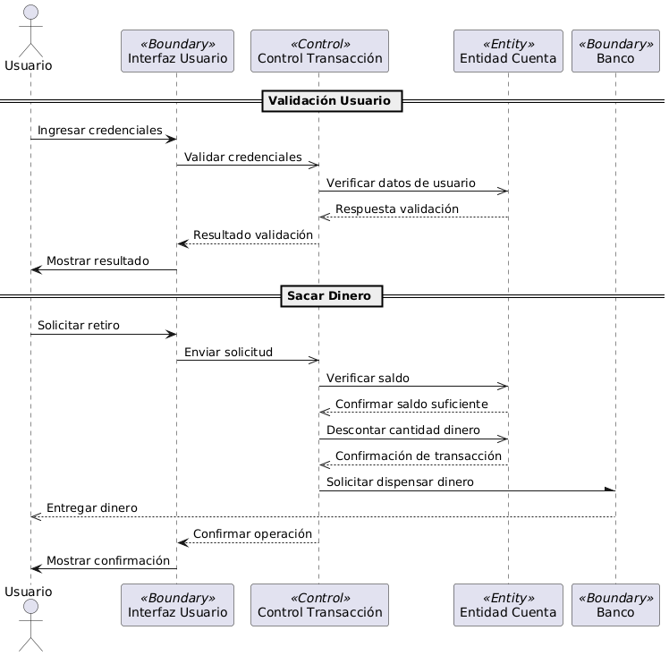

# Actividad de Diagramas de Secuencia

### Diagrama de Secuencia


### Código UML para PlantUML

```
@startuml
' DEFINO AQUI LOS PARTICIPANTES CON SUS ESTEREOTIPOS
actor Usuario
participant "Interfaz Usuario" as IU <<Boundary>>
participant "Control Transacción" as CT <<Control>>
participant "Entidad Cuenta" as EC <<Entity>>
participant "Banco" as Banco <<Boundary>>

' DIAGRAMA DE VALIDACIÓN DE USUARIO

== Validación Usuario ==
Usuario -> IU: Ingresar credenciales
IU ->> CT: Validar credenciales
CT ->> EC: Verificar datos de usuario
EC -->> CT: Respuesta validación
CT --> IU: Resultado validación
IU -> Usuario: Mostrar resultado

' DIAGRAMA PARA SACAR DINERO

== Sacar Dinero ==
Usuario -> IU: Solicitar retiro
IU ->> CT: Enviar solicitud
CT ->> EC: Verificar saldo
EC -->> CT: Confirmar saldo suficiente
CT ->> EC: Descontar monto
EC -->> CT: Confirmación de transacción
CT -\ Banco: Solicitar dispensación de dinero
Banco -->> Usuario: Entregar dinero
CT --> IU: Confirmar operación
IU -> Usuario: Mostrar confirmación
@enduml
```

### ¿De que manera te ayuda un diagrama de secuencias durante el proceso de desarrollo del software?
- Un diagrama de secuencias es realmente útil durante el proceso de desarrollo del software, porque te permite ver el flujo de las conexiones entre diferentes sitios de manera muy visual en una linea de tiempo.

- La visualización del tiempo te permite ver el orden en el que pueden ocurrir las peticiones y como interactua más a fondo el programa desde este punto de vista.

- Para mi otra ventaja espectacular que tiene los diagramas de secuencia, es que puedes observar facilmente si la conexión es simple, sincrona, asincrona, o si te da una respuesta. De esta forma puedes ver de forma muy visual que tipo de actividad/conexión se esta realizando entre cada entidad.

- 